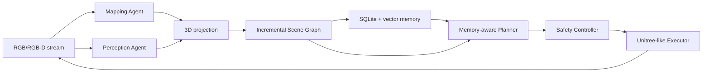

# Agentic Real-Time Memory-Aware Co-Planning

Training-free research prototype for long-horizon robot navigation. The runnable MVP
finds a red cup in a kitchen, incrementally updates an object-centric scene graph and
persistent memory, replans, and drives a safe Unitree-like simulated base near the cup.

The graph follows the Open3DSG subject-predicate-object idea while using an independent,
incremental runtime implementation. No Open3DSG source is copied into this package.

## Architecture



The default path is fully local and deterministic:

- `MockMapper`: streaming depth, pose, keyframes, local/global point cloud.
- `MockPerception`: repeatable kitchen and red-cup observations.
- `SceneGraph`: temporal directed multigraph with UUIDs and provenance.
- `SQLiteMemory`: episodic/semantic/spatial records plus local vector retrieval.
- `RuleBasedPlanner`: structured task parsing and receding-horizon replanning.
- `UnitreeSimExecutor`: bounded planar waypoint execution and emergency stop.

Optional adapters isolate LingBot-Map, VLMs, Habitat, ROS2/Unitree, Gazebo, and Isaac
Sim. Missing heavy dependencies never prevent the mock test suite from running.

## Install

Python 3.11 is recommended.

```bash
make install
```

## Mock End-to-End Demo

```bash
python scripts/run_demo.py --config configs/dev.yaml
```

Expected behavior: frame 1 produces an exploration action; frame 2 detects and
associates the red cup, updates `cup --inside--> kitchen`, replans, and reaches a nearby
waypoint.

## Offline Sequence to 3D Map

NumPy fixture folders contain `rgb_*.npy` and optional matching `depth_*.npy`. Video
files require the optional `opencv-python` package.

```bash
python scripts/run_offline_sequence.py \
	--input data/raw/example.mp4 \
	--config configs/default.yaml
```

## Simulated Navigation

```bash
python scripts/run_simulation.py \
	--scene path/to/scene.glb \
	--instruction "Find the red cup in the kitchen" \
	--config configs/simulation.yaml
```

When Habitat-Sim is unavailable, this command reports the degradation and uses the
Unitree-like simulator. Habitat is a visual/navigation world backend, not a validated
Unitree Go2 dynamics model.

## Evaluation

```bash
python scripts/evaluate.py \
	--run-dir outputs/<run_id> \
	--config configs/evaluation.yaml
```

Every run saves:

```text
outputs/<run_id>/metrics.json
outputs/<run_id>/trajectory.jsonl
outputs/<run_id>/scene_graph.json
outputs/<run_id>/memory_snapshot.json
outputs/<run_id>/config.yaml
outputs/<run_id>/logs.jsonl
```

## Quality Checks

```bash
pytest -q
ruff check .
ruff format --check .
```

## Real Backend Boundaries

- LingBot-Map remains an external dependency. Its adapter validates installation and
	checkpoint configuration, but runtime activation is gated on pose-convention tests.
- VLM/LLM adapters fail closed when not configured; deterministic fallbacks remain
	available.
- Real robot interfaces are disabled by default and cannot be enabled accidentally by
	an API response or planner output.
- Dataset adapters keep ETH3D geometry evaluation separate from language-navigation
	instructions and trajectories.

See [architecture](docs/architecture.md), [dependency decisions](docs/dependency-decisions.md),
and [limitations](docs/limitations.md) for verified boundaries and open work.


python examples/viewer.py --scene /home/snt/projects/AgenticMemoryNav/data/scene_datasets/scene_datasets/habitat-test-scenes/van-gogh-room.glb


python examples/viewer.py --scene /home/snt/projects/AgenticMemoryNav/data/scene_datasets/scene_datasets/habitat-test-scenes/van-gogh-room.glb
