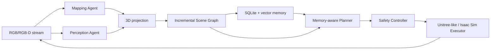

# Agentic Real-Time Memory-Aware Co-Planning

Training-free research prototype for long-horizon robot navigation. The runnable MVP
finds a red cup in a kitchen, incrementally updates an object-centric scene graph and
persistent memory, replans, and drives a safe Unitree-like simulated base near the cup.

The graph follows the Open3DSG subject-predicate-object idea while using an independent,
incremental runtime implementation. No Open3DSG source is copied into this package.

## Architecture



The default path is fully local and deterministic:

- `MockMapper`: streaming depth, pose, keyframes, local/global point cloud.
- `MockPerception`: repeatable kitchen and red-cup observations.
- `SceneGraph`: temporal directed multigraph with UUIDs and provenance.
- `SQLiteMemory`: episodic/semantic/spatial records plus local vector retrieval.
- `RuleBasedPlanner`: structured task parsing and receding-horizon replanning.
- `UnitreeSimExecutor` / `IsaacSimExecutor`: bounded waypoint/velocity execution,
  the standard discrete action set, and emergency stop.

Optional adapters isolate LingBot-Map, VLMs, and Isaac Sim. Missing heavy dependencies
never prevent the mock test suite from running.

## Install

Python 3.11 is recommended.

```bash
make install
```

## Standard Action Space

Both `UnitreeSimExecutor` (mock backend) and `IsaacSimExecutor` implement the same
expanded discrete control set via `apply_discrete_action()`
(`src/agentic_memory_nav/agent/execution/discrete_actions.py`):

| ID | Action            | Effect                                              |
|----|-------------------|------------------------------------------------------|
| 0  | `turn_left`       | rotate left 15° (0.262 rad)                         |
| 1  | `turn_right`      | rotate right 15° (0.262 rad)                        |
| 2  | `move_forward`    | move forward 0.25 m along the current heading       |
| 3  | `stop`            | stop and declare task completion                    |
| 4  | `look_up`         | tilt camera up 30° (0.524 rad), clamped to ±60°     |
| 5  | `look_down`       | tilt camera down 30° (0.524 rad), clamped to ±60°   |
| 6  | `turn_left_big`   | rotate left 90° (1.571 rad)                         |
| 7  | `turn_right_big`  | rotate right 90° (1.571 rad)                        |
| 8  | `move_backward`   | move backward 0.25 m along the current heading      |

`IsaacSimExecutor.apply_discrete_action` reuses the existing collision predicate for
`move_forward` and `move_backward` and fails closed (reports a collision, does not move)
if the step would intersect the environment. This is additive: `send_velocity_command` and
`send_waypoint` are unchanged and still used by the planner-driven pipeline and the
other Isaac Sim preview scripts below.

## Mock End-to-End Demo

```bash
python scripts/run_demo.py --config configs/default.yaml
```

Expected behavior: frame 1 produces an exploration action; frame 2 detects and
associates the red cup, updates `cup --inside--> kitchen`, replans, and reaches a nearby
waypoint.

## Offline Sequence to 3D Map

NumPy fixture folders contain `rgb_*.npy` and optional matching `depth_*.npy`. Video
files require the optional `opencv-python` package.

```bash
python scripts/run_offline_sequence.py \
	--input data/raw/example.mp4 \
	--config configs/default.yaml
```

## LingBot-Map and Ground-Truth Point-Cloud Evaluation

LingBot-Map runs in an isolated Python 3.10/CUDA environment. Export a
confidence-filtered world-point artifact from RGB frames with:

```bash
.lingbot-venv/bin/python scripts/run_lingbot_reconstruction.py \
  --image-folder external-lib/lingbot-map/example/courthouse \
  --first-k 2 \
  --checkpoint external-lib/lingbot-map/models/lingbot-map/lingbot-map.pt \
  --output outputs/lingbot/courthouse_points.npz
```

The artifact contract is `points: float32 (N, 3)` in an NPZ file. Construct a paired
ground-truth cloud from calibrated metric depth, a $3\times3$ intrinsics JSON, and a
JSON mapping each `depth_*.npy` filename to its camera-to-world $4\times4$ pose:

```bash
python scripts/build_ground_truth_pointcloud.py \
  --depth-dir data/ground_truth/depth \
  --intrinsics-json data/ground_truth/intrinsics.json \
  --poses-json data/ground_truth/camera_to_world.json \
  --output data/ground_truth/scene_points.npz
```

Compare the two paired artifacts:

```bash
python scripts/evaluate_pointcloud.py \
  --prediction outputs/lingbot/courthouse_points.npz \
  --ground-truth data/ground_truth/scene_points.npz \
  --threshold-m 0.05 \
  --alignment none \
  --output outputs/lingbot/courthouse_vs_gt.json
```

`--alignment none` is the valid benchmark default: it evaluates the shared world
frame and includes pose error. `--alignment centroid` is a diagnostic
translation-only comparison, not a substitute for camera or trajectory calibration.
The report contains accuracy, completeness, symmetric Chamfer-L1, precision, recall,
and F1.

For RGB-only LingBot mapping, the intended geometry source is predicted depth plus
camera-to-world pose backprojection, not the optional point head. Configure bounded
local submaps through `mapping.local_submap_frames`, `local_submap_stride`, and
`local_submap_stability_threshold_m`. The window counts sampled frames: `300` at a
stride of `2` covers roughly 600 input frames. Only a window whose adjacent local-cloud
overlap residual stays within the configured threshold is committed as a spatial-memory
artifact. This is an RGB-only runtime policy (`geometry_memory_policy: stable_rgb_only`):
LiDAR, RGB-D, and ground truth are optional offline evaluation sources, never mandatory
runtime dependencies for constructing agent memory.

## Isaac Sim Interactive Preview

Requires a local Isaac Sim install (verified with 6.0.1) and must run with Isaac Sim's
bundled Python, not the project's own venv:

```bash
conda deactivate  # avoid conda's Python shadowing Isaac Sim's own interpreter
~/isaacsim/kit/python/bin/python3 -m pip install -e .   # one-time: install this project into Isaac Sim's Python
~/isaacsim/kit/python/bin/python3 -m pip install networkx  # one-time: only missing core dependency
```

Two interactive previews are available. Both render the configured scene, a kinematic
Go2, and dynamic-bound ground/ceiling planes:

- `scripts/preview_isaacsim_navigation_actions.py` — the standard 6-action set above,
  one action per keypress (digits `0`-`5`, or `w`/`a`/`d`/space/arrow-key aliases).

  ```bash
  ~/isaacsim/python.sh scripts/preview_isaacsim_navigation_actions.py \
      --config configs/isaacsim_realtime_agent_internscenes.yaml --livestream
  ```

- `scripts/preview_isaacsim_navigation_wasd.py` — continuous WASD/QE velocity teleop
  (`send_velocity_command`), for free-form driving rather than discrete steps.

- `scripts/preview_isaacsim_navigation_vlm_discrete.py` — **VLM-driven object search
  using only the standard 6 discrete actions** (`turn_left`, `turn_right`,
  `move_forward`, `look_up`, `look_down`, `stop`). No LingBot-Map, no scene graph,
  no memory: the VLM looks at the current RGB frame and decides the next action.
  Default instruction: "Find the green shoe in the room". Turn/move/look step sizes
  are configurable (`--turn-step-deg`, `--move-step-m`, `--look-step-deg`); a blocked
  `move_forward` never ends the episode (the robot turns away and keeps deciding),
  and the camera is automatically re-leveled if a `look_up`/`look_down` didn't find
  the target.

  ```bash
  ~/isaacsim/python.sh scripts/preview_isaacsim_navigation_vlm_discrete.py \
      --config configs/isaacsim_realtime_agent_internscenes.yaml --livestream
  ```

A LingBot-Map variant (`preview_isaacsim_navigation_wasd_with_lingbot-map.py`) drives
the same WASD control while streaming the reconstructed point cloud to an in-browser
3D viewer, and `run_isaacsim_realtime_agent.py` / `preview_isaacsim_navigation_vlm.py`
run the full memory-aware pipeline or a reactive VLM baseline against a live Isaac Sim
camera. All Isaac Sim scripts share the same `execution`/`mapping`/`perception` config
sections documented inline in
[configs/isaacsim_realtime_agent_internscenes.yaml](configs/isaacsim_realtime_agent_internscenes.yaml).

## Evaluation

```bash
python scripts/evaluate.py --run-dir outputs/<run_id>
```

Every run saves:

```text
outputs/<run_id>/metrics.json
outputs/<run_id>/trajectory.jsonl
outputs/<run_id>/scene_graph.json
outputs/<run_id>/memory_snapshot.json
outputs/<run_id>/config.yaml
outputs/<run_id>/logs.jsonl
```

## Quality Checks

```bash
pytest -q
ruff check .
ruff format --check .
```

## Real Backend Boundaries

- LingBot-Map remains an external dependency. Its adapter validates installation and
	checkpoint configuration, but runtime activation is gated on pose-convention tests.
- VLM/LLM adapters fail closed when not configured; deterministic fallbacks remain
	available.
- Real robot interfaces are disabled by default and cannot be enabled accidentally by
	an API response or planner output.


## Commandline for Demo Identification

Action Simulation:

~/isaacsim/python.sh scripts/preview_isaacsim_navigation_actions.py \
    --config configs/isaacsim_realtime_agent_internscenes.yaml \
    --livestream \
    --public-ip 127.0.0.1

lingbot-Video Simulation

.lingbot-venv/bin/python3 scripts/lingbot_web_demo/server.py \
    --port 8123 \
    --video /home/snt/projects/AgenticMemoryNav/outputs/lingbot_demo/paris-street.mp4 \
    --fps 10 \
    --checkpoint external-lib/lingbot-map/models/lingbot-map/lingbot-map.pt \
    --num-scale-frames 8 \
    --keyframe-interval 1 \
    --conf-threshold 1.5 \
    --point-stride 8


Full VLM Simulation

cd /home/snt/projects/AgenticMemoryNav
conda deactivate
~/isaacsim/python.sh scripts/preview_isaacsim_navigation_vlm_discrete.py \
    --config configs/isaacsim_realtime_agent_internscenes.yaml \
    --instruction "Find the green shoe in the room" \
    --max-look-count 1 \
    --turn-step-deg 20 \
    --move-step-m 0.25 \
    --look-step-deg 30 \
    --steps 150 \
    --livestream \
    --public-ip 127.0.0.1


~/isaacsim/python.sh scripts/preview_isaacsim_navigation_vlm_discrete.py     --config configs/isaacsim_realtime_agent_internscenes_test.yaml    --livestream     --public-ip 127.0.0.1     --steps 100     --turn-step-deg 15.0     --move-step-m 0.20