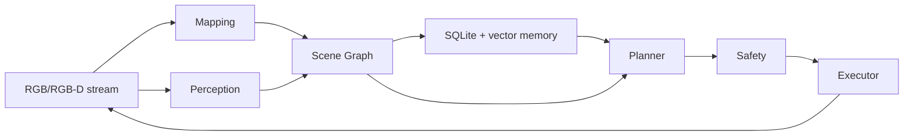

# Agentic Memory-Aware Navigation

Training-free research prototype for long-horizon robot navigation. The runnable MVP
finds a red cup in a kitchen, builds an object-centric scene graph, stores persistent
memory, replans, and drives a simulated base near the target.

The scene-graph design is inspired by Open3DSG but implemented independently here.

## Architecture



Default stack (no GPU or Isaac Sim required):

- `MockMapper` – deterministic depth, pose, keyframes, point clouds.
- `MockPerception` – repeatable room and red-cup detections.
- `SceneGraph` – incremental directed multigraph with UUIDs and provenance.
- `SQLiteMemory` – episodic/semantic/spatial records with local vector retrieval.
- `RuleBasedPlanner` – task parsing and receding-horizon replanning.
- `UnitreeSimExecutor` / `IsaacSimExecutor` – bounded waypoint/velocity execution,
  discrete actions, and emergency stop.

Optional adapters keep LingBot-Map, VLMs, and Isaac Sim isolated; the mock suite runs
without them.

## Install

Requires Python >=3.11.

```bash
make install
```

## Quickstart

Run the mock end-to-end demo:

```bash
python main.py --config configs/default.yaml
```

This runs `find the red cup in the kitchen` for up to `runtime.max_frames`. The run is
saved under `outputs/<timestamp>/` with metrics, trajectory, scene graph, and memory
snapshot.

Pass a custom instruction:

```bash
python main.py --config configs/default.yaml --instruction "find the cup in the kitchen"
```

## Discrete Action Space

Both backends share the same action IDs in
[src/agentic_memory_nav/agent/execution/discrete_actions.py](src/agentic_memory_nav/agent/execution/discrete_actions.py):

| ID | Action          | Effect                                      |
|----|-----------------|---------------------------------------------|
| 0  | `turn_left`     | rotate left 15°                             |
| 1  | `turn_right`    | rotate right 15°                            |
| 2  | `move_forward`  | move forward 0.25 m                         |
| 3  | `stop`          | stop / declare completion                   |
| 4  | `look_up`       | tilt camera up 30° (clamped to ±60°)        |
| 5  | `look_down`     | tilt camera down 30° (clamped to ±60°)      |
| 6  | `turn_left_big` | rotate left 90°                             |
| 7  | `turn_right_big`| rotate right 90°                            |
| 8  | `move_backward` | move backward 0.25 m                        |

## Isaac Sim Previews

Requires a local Isaac Sim install (tested with 6.0.1). Use Isaac Sim's bundled Python,
not the project venv:

```bash
conda deactivate
~/isaacsim/kit/python/bin/python3 -m pip install -e .
~/isaacsim/kit/python/bin/python3 -m pip install networkx
```

Examples:

```bash
# Discrete action teleop (0-5)
~/isaacsim/python.sh scripts/preview_isaacsim_navigation_actions.py \
    --config configs/isaacsim_realtime_agent_internscenes.yaml --livestream

# VLM-driven object search with the same 6 actions
~/isaacsim/python.sh scripts/preview_isaacsim_navigation_vlm_discrete.py \
    --config configs/isaacsim_realtime_agent_internscenes.yaml --livestream
```

See
[configs/isaacsim_realtime_agent_internscenes.yaml](configs/isaacsim_realtime_agent_internscenes.yaml)
for execution/mapping/perception settings.

## Evaluation

```bash
python scripts/evaluate.py --run-dir outputs/<run_id>
```

Run artifacts include:

```text
outputs/<run_id>/metrics.json
outputs/<run_id>/trajectory.jsonl
outputs/<run_id>/scene_graph.json
outputs/<run_id>/memory_snapshot.json
outputs/<run_id>/config.yaml
outputs/<run_id>/logs.jsonl
```

## Quality Checks

```bash
make test
make lint
```

## Backend Boundaries

- LingBot-Map stays external; activation is gated on installation and checkpoint checks.
- VLM/LLM adapters fail closed when not configured; deterministic fallbacks remain available.
- Real-robot interfaces are disabled by default.