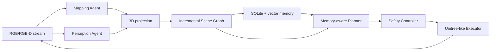

# Agentic Real-Time Memory-Aware Co-Planning

Training-free research prototype for long-horizon robot navigation. The runnable MVP
finds a red cup in a kitchen, incrementally updates an object-centric scene graph and
persistent memory, replans, and drives a safe Unitree-like simulated base near the cup.

The graph follows the Open3DSG subject-predicate-object idea while using an independent,
incremental runtime implementation. No Open3DSG source is copied into this package.

## Architecture



The default path is fully local and deterministic:

- `MockMapper`: streaming depth, pose, keyframes, local/global point cloud.
- `MockPerception`: repeatable kitchen and red-cup observations.
- `SceneGraph`: temporal directed multigraph with UUIDs and provenance.
- `SQLiteMemory`: episodic/semantic/spatial records plus local vector retrieval.
- `RuleBasedPlanner`: structured task parsing and receding-horizon replanning.
- `UnitreeSimExecutor`: bounded planar waypoint execution and emergency stop.

Optional adapters isolate LingBot-Map, VLMs, Habitat, ROS2/Unitree, Gazebo, and Isaac
Sim. Missing heavy dependencies never prevent the mock test suite from running.

## Install

Python 3.11 is recommended.

```bash
make install
```

## Mock End-to-End Demo

```bash
python scripts/run_demo.py --config configs/dev.yaml
```

Expected behavior: frame 1 produces an exploration action; frame 2 detects and
associates the red cup, updates `cup --inside--> kitchen`, replans, and reaches a nearby
waypoint.

## Offline Sequence to 3D Map

NumPy fixture folders contain `rgb_*.npy` and optional matching `depth_*.npy`. Video
files require the optional `opencv-python` package.

```bash
python scripts/run_offline_sequence.py \
	--input data/raw/example.mp4 \
	--config configs/default.yaml
```

## LingBot-Map and Ground-Truth Point-Cloud Evaluation

LingBot-Map runs in an isolated Python 3.10/CUDA environment. Export a
confidence-filtered world-point artifact from RGB frames with:

```bash
.lingbot-venv/bin/python scripts/run_lingbot_reconstruction.py \
  --image-folder external-lib/lingbot-map/example/courthouse \
  --first-k 2 \
  --checkpoint external-lib/lingbot-map/models/lingbot-map/lingbot-map.pt \
  --output outputs/lingbot/courthouse_points.npz
```

The artifact contract is `points: float32 (N, 3)` in an NPZ file. Construct a paired
ground-truth cloud from calibrated metric depth, a $3\times3$ intrinsics JSON, and a
JSON mapping each `depth_*.npy` filename to its camera-to-world $4\times4$ pose:

```bash
python scripts/build_ground_truth_pointcloud.py \
  --depth-dir data/ground_truth/depth \
  --intrinsics-json data/ground_truth/intrinsics.json \
  --poses-json data/ground_truth/camera_to_world.json \
  --output data/ground_truth/scene_points.npz
```

Compare the two paired artifacts:

```bash
python scripts/evaluate_pointcloud.py \
  --prediction outputs/lingbot/courthouse_points.npz \
  --ground-truth data/ground_truth/scene_points.npz \
  --threshold-m 0.05 \
  --alignment none \
  --output outputs/lingbot/courthouse_vs_gt.json
```

`--alignment none` is the valid benchmark default: it evaluates the shared world
frame and includes pose error. `--alignment centroid` is a diagnostic
translation-only comparison, not a substitute for camera or trajectory calibration.
The report contains accuracy, completeness, symmetric Chamfer-L1, precision, recall,
and F1. [configs/pointcloud_evaluation.yaml](configs/pointcloud_evaluation.yaml)
records these defaults.

For RGB-only LingBot mapping, the intended geometry source is predicted depth plus
camera-to-world pose backprojection, not the optional point head. Configure bounded
local submaps through `mapping.local_submap_frames`, `local_submap_stride`, and
`local_submap_stability_threshold_m`. The window counts sampled frames: `300` at a
stride of `2` covers roughly 600 input frames. Only a window whose adjacent local-cloud
overlap residual stays within the configured threshold is committed as a spatial-memory
artifact. This is an RGB-only runtime policy (`geometry_memory_policy: stable_rgb_only`):
LiDAR, RGB-D, and ground truth are optional offline evaluation sources, never mandatory
runtime dependencies for constructing agent memory.

## Simulated Navigation

```bash
python scripts/run_simulation.py \
	--scene path/to/scene.glb \
	--instruction "Find the red cup in the kitchen" \
	--config configs/simulation.yaml
```

When Habitat-Sim is unavailable, this command reports the degradation and uses the
Unitree-like simulator. Habitat is a visual/navigation world backend, not a validated
Unitree Go2 dynamics model.

## Isaac Sim Benchmarks (PointNav / ObjectNav)

Requires a local Isaac Sim install (verified with 6.0.1) and must run with Isaac Sim's
bundled Python, not the project's own venv:

```bash
conda deactivate  # avoid conda's Python shadowing Isaac Sim's own interpreter
~/isaacsim/kit/python/bin/python3 -m pip install -e .   # one-time: install this project into Isaac Sim's Python
~/isaacsim/kit/python/bin/python3 -m pip install networkx  # one-time: only missing core dependency

~/isaacsim/python.sh scripts/run_isaacsim_pointnav.py --config configs/isaacsim_pointnav.yaml
```

PointNav episodes are generated procedurally (no external scene/episode dataset
download); see `src/agentic_memory_nav/datasets/pointnav.py`.

ObjectNav requires the InteriorAgent dataset
(huggingface.co/datasets/spatialverse/InteriorAgent) and an `experiments.json` file
following the schema documented in
[docs/dependency-decisions.md](docs/dependency-decisions.md):

```bash
~/isaacsim/python.sh scripts/run_isaacsim_objectnav.py \
	--scene-root /path/to/InteriorAgent \
	--experiments-json /path/to/InteriorAgent/experiments.json \
	--experiment kujiale_0020_bottle_moved
```

See [notebooks/isaacsim_benchmarks.ipynb](notebooks/isaacsim_benchmarks.ipynb) for setup,
usage, and evaluation walkthroughs of both benchmarks.

### Isaac Sim Sensor Recording for LingBot Ground Truth

The PointNav-style procedural Isaac world can also record a paired RGB-D and LiDAR
sequence for reconstruction evaluation. It creates a clearly labeled kinematic
quadruped proxy, not a simulated Unitree Go2: it has a body and four legs for sensor
placement, but no articulated joints, contact model, or locomotion controller.

```bash
~/isaacsim/python.sh scripts/record_isaacsim_sequence.py \
  --output outputs/isaacsim_sequence \
  --frames 24 \
  --camera-width 128 \
  --camera-height 96

python scripts/build_ground_truth_pointcloud.py \
  --depth-dir outputs/isaacsim_sequence/depth \
  --intrinsics-json outputs/isaacsim_sequence/intrinsics.json \
  --poses-json outputs/isaacsim_sequence/camera_to_world.json \
  --output outputs/isaacsim_sequence/scene_points_gt.npz
```

The recorder emits RGB PNG frames, metric depth NPY frames, OpenCV-camera-to-Isaac-world
`c2w` matrices, and one RTX 2D LiDAR flat scan NPZ per frame. Use the resulting GT cloud
with the LingBot export and `scripts/evaluate_pointcloud.py` described above. The recorder
uses the `Example_Rotary_2D` RTX LiDAR configuration; it does not emulate a specific Go2
sensor model.

## Evaluation

```bash
python scripts/evaluate.py \
	--run-dir outputs/<run_id> \
	--config configs/evaluation.yaml
```

Every run saves:

```text
outputs/<run_id>/metrics.json
outputs/<run_id>/trajectory.jsonl
outputs/<run_id>/scene_graph.json
outputs/<run_id>/memory_snapshot.json
outputs/<run_id>/config.yaml
outputs/<run_id>/logs.jsonl
```

## Quality Checks

```bash
pytest -q
ruff check .
ruff format --check .
```

## 中文代码导读：每个模块的作用与实现思路

下面这部分是对项目代码的中文说明，重点解释“每个模块想解决什么问题、输入输出是什么、它在系统中的位置”。这一层解释不改变任何运行逻辑，只用于学习和阅读代码。

### 1. 入口与总览：`main.py` 与 `src/agentic_memory_nav/__init__.py`

- `main.py` 是项目最简单的对外入口，当前主要用于确认包能被正确导入。
- `src/agentic_memory_nav/__init__.py` 说明这个包的定位：这是一个研究性导航框架，目标是“agentic memory-aware navigation”。
- 从项目设计上看，这个仓库不是一个单一脚本，而是一个小型机器人导航系统：mapping（建图）→ perception（感知）→ scene graph（场景图）→ memory（记忆）→ planner（规划）→ executor（执行）。

### 2. 所有数据结构的定义：`src/agentic_memory_nav/common/types.py`

这是整个项目最关键的“协议层”，相当于定义了一套统一接口。

- `Vector3` 是三维坐标，例如 `(x, y, z)`。
- `Pose3D` 表示姿态，包含位置和 yaw（偏航角）。
- `FrameObservation` 表示一帧图像/深度数据，包含 rgb、depth、camera_pose、robot_pose 等信息。
- `MappingUpdate` 表示一次建图更新结果，包括 local_pointcloud 和 global_pointcloud。
- `ObjectObservation` 表示一次检测到的物体，包含 category、attributes、bbox_2d、center_3d、dimensions_3d、confidence 等。
- `SceneNode` 表示 Scene Graph 中的节点，带 node_type、label、position_3d、bbox_3d、confidence、provenance 等字段。
- `SceneEdge` 表示节点之间的关系边，如 `inside`, `near`, `left_of` 等。
- `MemoryItem` 表示记忆项，支持 episodic / semantic / spatial / task / uncertainty 等类型。
- `NavigationTask` 表示任务描述，包含原始指令、解析后的目标等。
- `ActionIntent` 表示下一步执行意图，比如 explore / navigate / verify。

一句话总结：这里定义了“机器人感知、地图、图、记忆、任务和动作”的统一数据语言。后续所有代码都依赖这些结构。

### 3. 地图模块：`src/agentic_memory_nav/mapping/mock_mapper.py`

- `MockMapper` 是默认的本地 CPU 版本地图器，用于无依赖跑通整个系统。
- 它会接收 `FrameObservation`，生成 `MappingUpdate`。
- 核心动作包括：
  - 从深度图反投影生成局部点云；
  - 按照时间保留 keyframe；
  - 累积全局点云；
  - 维护 `map_version` 与 keyframe 状态。
- 这个模块并不是真正的 SLAM 后端，而是一个稳定、可测试的“mock 版本地图器”。
- 其作用是：保证系统即使没有 LingBot-Map、Habitat 或 GPU，也可以在本地跑通。

### 4. 视觉感知模块：`src/agentic_memory_nav/perception/mock_perception.py`

- 这部分用于“检测对象”。
- 默认实现非常简单：在模拟场景中，固定生成 kitchen 和 cup 这样的对象。
- 例如 `MockPerception.detect(frame, mapping)` 返回一个 `ObjectObservation` 列表。
- 其中 `kitchen` 是房间对象，`cup` 是目标对象。
- 这种设计的好处是：
  - 可复现；
  - 不依赖模型；
  - 适合验证 Scene Graph 和 Planner 的逻辑正确性。

### 5. 场景图核心：`src/agentic_memory_nav/scene_graph/graph.py`

- `SceneGraph` 是存储 graph 的核心容器，底层用 `networkx.MultiDiGraph`。
- `upsert_node()` 和 `upsert_edge()` 分别添加/更新节点和边。
- `nodes()` 和 `edges()` 直接返回图中节点/边。
- `find_nodes(label, attributes)` 是按标签和属性查找节点。
- `relations(node_id)` 返回与某节点有关的所有关系。

它的作用是：

- 存储对象节点；
- 存储“对象之间”的空间关系；
- 让 planner 能基于图结构做推理。

这个图不是把“点云当节点”放进去，而是把“抽象对象（如 cup, kitchen）”当节点，点云信息被用作它们的几何证据。

### 6. 图更新逻辑：`src/agentic_memory_nav/scene_graph/updater.py`

- `SceneGraphUpdater` 会把每一帧检测到的 `ObjectObservation` 合并进图中。
- 核心过程：
  1. 先进行 association（关联）
  2. 若对象已存在，则更新它的位置信息
  3. 否则创建新的节点
  4. 再根据几何关系推断 `inside`、`near`、`left_of` 等边

这是项目中最关键的“对象图增长逻辑”。

关键点：

- 它的 node 不是 raw point cloud；
- 它的几何信息来自 `center_3d`、`bbox_3d` 等抽象属性；
- 它会把关系结构化为 graph edge，而不是把整片点云挂在节点上。

### 7. 记忆模块：`src/agentic_memory_nav/memory/sqlite_store.py`

- 这是长期记忆的核心实现。
- 它用 SQLite 保存 structured data，同时用 local vector store 做文本相似度搜索。
- `add_observation()` 保存一条记忆；
- `retrieve_by_text()` 根据文字查询记忆；
- `retrieve_by_region()` 根据位置查询附近记忆；
- `retrieve_by_time()` 根据时间窗口检索；
- `consolidate()` 可以聚合多条记忆；
- `record_contradiction()` 可以保存矛盾信息。

这说明项目的“memory”既不是单纯的 SLAM 地图，也不是纯对象图，而是“多种记忆类型的持久化存储”。

### 8. 规划器：`src/agentic_memory_nav/planning/rule_based_fallback.py`

- `RuleBasedPlanner` 是项目默认的规划器。
- 它读取：
  - 任务指令；
  - 当前 robot pose；
  - scene graph；
  - memory；
  - 以及重规划原因。
- 它会尝试在 graph 中寻找目标对象（例如 red cup），并在目标出现时输出 `ActionIntent`。

它的规划是 deterministic 的，因此很适合验证系统设计，而不是用来做高端的 LLM 推理。

### 9. 执行器：`src/agentic_memory_nav/execution/unitree_sim.py`

- `UnitreeSimExecutor` 是一个类 Unitree 的仿真执行器。
- 它不是硬件真实控制器，而是一个“安全的 planar waypoint executor”。
- 它接收 waypoint，并将其转换成一个受限的平面运动轨迹。
- 它包含：
  - 速度上限；
  - 角速度上限；
  - waypoint 追踪；
  - collision 设置；
  - emergency stop。

它的定位非常明确：这是系统安全层与执行层，不是底层真实机器人控制算法。

### 10. 流水线编排：`src/agentic_memory_nav/orchestration/pipeline.py`

- `NavigationPipeline` 是整个系统最重要的编排器。
- 按照循环做：
  1. 从 executor 收到一帧观测；
  2. mapper 更新地图；
  3. perception 检测对象；
  4. scene graph 更新；
  5. memory 存储；
  6. planner 规划动作；
  7. executor 执行动作；
  8. 根据结果重规划或完成任务。

这说明项目原型不是“单个 agent”，而是一个多模块 agentic pipeline。

### 11. 启动脚本：`scripts/run_demo.py` / `scripts/run_simulation.py`

- `scripts/run_demo.py` 是端到端 demo；
- `scripts/run_simulation.py` 是模拟导航入口；
- 这些脚本把运行参数、任务指令、导出目录串起来，形成一个完整流程。

### 12. 项目的真实定位

从代码结构看，这个项目的主要实现目标是：

- 把一个导航任务分解为多模块 agent；
- 让对象/房间/关系统一进入 scene graph；
- 把观察结果转成 memory；
- 让 planner 在 graph + memory 上做决策；
- 让 executor 执行安全动作。

这更接近“agentic navigation architecture”而不是“单一 3D point cloud node scene graph”。

---

## 你的想法和当前代码的对比

你的核心想法是：

> Scene Graph 中的 node 是 3D 点云；基于这个 3D 点云做整个 scene graph 架构；再用它来构建 agent memory。

这个想法很有启发性，但和当前这个仓库的设计并不完全一致。

### 当前仓库中“真正实现的结构”是什么？

- `mapping` 生成 `global_pointcloud`；
- `scene_graph` 中的 `SceneNode` 存的是：
  - label；
  - type；
  - position_3d；
  - bbox_3d；
  - confidence；
  - observation_count；
  - provenance；
- node 本身并不是整块点云；
- point cloud 更像是底层几何证据，而不是 graph 的主要节点对象。

### 这和你的想法的区别在哪里？

你的想法属于更加“几何原始表示”的图结构：

- node = 点云对象/区域/物体
- edge = 空间关系
- memory = 基于这些 point-cloud node 的长期记忆

而这个仓库的当前实现属于更轻量的“对象中心图”：

- node = 语义对象 / room / region
- 3D information = 坐标 + bbox
- point cloud = 地图层/几何层，不直接作为 node

### 为什么现在不直接做“node=3D point cloud”？

因为这会带来几个工程上的现实问题：

1. 点云节点体积大。
   - 一个物体的点云可能有上千个点；多个物体叠加后，图会非常重。

2. 图结构的查询和更新复杂度增加。
   - 不是所有查询都需要整块点云，很多时候只需要中心点和 bbox 就足够。

3. 基础记忆设计更偏向文本/结构化 payload。
   - 当前 `MemoryItem` 是面向内容、实体、位置、时序的，而不是直接存 point cloud。

4. 这个项目当前是一个“研究原型”，优先验证整体 agentic pipeline，而不是做到高 fidelity 3D scene graph 表示。

### 结论

当前代码没有“完全实现你说的 point-cloud-node scene graph”。

但它已经实现了你想法中很重要的前半部分：

- 3D geometry 是存在的；
- scene graph 是存在的；
- memory 是存在的；
- agentic planner 也是存在的；
- 关键缺口在于：这些几何信息还没有被设计为 graph 的原始节点表示。

也就是说：

- 这个仓库目前是“3D geometry + semantic graph + memory agent”；
- 你的想法更接近“point-cloud-native scene graph + memory”。

这两者在架构层面不是完全一样，但它们是相容的。你可以把当前图结构理解为“轻量版本”，再把点云提升为更底层的对象节点表示。

---

## 继续改进的建议（不改当前代码，只给你留出思路）

如果未来要从当前实现升级到你的版本，建议考虑以下步骤：

1. 扩展 `SceneNode`：增加 `point_cloud_ref` 或 `cloud_id` 字段。
2. 让 graph node 可以挂载一个点云摘要，而不是只存中心点。
3. 在 `MemoryItem` 中保留 `point_cloud_ref`，让记忆能引用 3D geometry。
4. 在 planner 中增加“基于点云相似度和几何一致性”的检索方式。
5. 把 `SceneGraphUpdater` 的几何关系规则从“抽象位置”升级到“点云聚类 + 包围盒 + 语义约束”。

这样就能从现在的“对象-centric graph”逐步过渡到你想要的“点云-centric scene graph”。

## Real Backend Boundaries

- LingBot-Map remains an external dependency. Its adapter validates installation and
	checkpoint configuration, but runtime activation is gated on pose-convention tests.
- VLM/LLM adapters fail closed when not configured; deterministic fallbacks remain
	available.
- Real robot interfaces are disabled by default and cannot be enabled accidentally by
	an API response or planner output.
- Dataset adapters keep ETH3D geometry evaluation separate from language-navigation
	instructions and trajectories.

See [architecture](docs/architecture.md), [dependency decisions](docs/dependency-decisions.md),
and [limitations](docs/limitations.md) for verified boundaries and open work.


python examples/viewer.py --scene /home/snt/projects/AgenticMemoryNav/data/scene_datasets/scene_datasets/habitat-test-scenes/van-gogh-room.glb


python examples/viewer.py --scene /home/snt/projects/AgenticMemoryNav/data/scene_datasets/scene_datasets/habitat-test-scenes/van-gogh-room.glb
