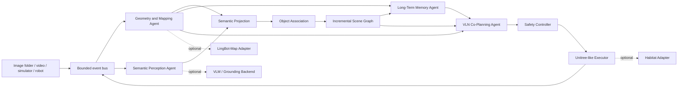

# Agentic Real-Time Memory-Aware Co-Planning Architecture

Status: Phase 0 design baseline (2026-08-09)

## 1. Scope

The project is a training-free research prototype for long-horizon navigation. It
keeps an Open3DSG-style object-centric directed graph, but replaces learned scene
graph training with incremental geometry, configurable foundation-model inference,
deterministic relation rules, persistent memory, and agentic replanning.

The first runnable target is a mock end-to-end system. Real LingBot-Map, Habitat,
VLM, and robot integrations remain optional plugins so that tests do not require a
GPU, checkpoints, simulator assets, network access, or API credentials.

## 2. Verified Repository Facts

- `lingbot-map` exposes `GCTStream` with streaming and windowed inference.
- LingBot-Map streaming uses an in-process KV cache. Its high-level
  `inference_streaming` method accepts a sequence, while true `update(frame)` must
  drive the initial scale-frame call and later one-frame `forward` calls directly.
- LingBot-Map predicts pose encoding, depth, confidence, and optional world points.
- Habitat-Lab uses Habitat-Sim for RGB-D simulation, agent poses, NavMesh queries,
  shortest paths, semantic annotations, and collision feedback.
- Habitat contains articulated robot examples, including Spot and AlienGo-related
  support, but no verified Unitree Go2 dynamics or controller contract.
- Open3DSG represents object instances as nodes and directed object pairs as edges.
  Its runtime is not a lightweight online scene-graph library; its source is
  AGPL-3.0 and its model stack is tightly coupled to offline preprocessing and
  large vision models.
- The active Python is 3.12.3. Torch, Habitat, Habitat-Sim, and LingBot-Map are not
  installed. `nvidia-smi` cannot currently communicate with an NVIDIA driver.

## 3. System Context



The planner emits high-level goals, constraints, and waypoints only. It never emits
raw joint commands or unvalidated base velocity commands.

## 4. Agent Responsibilities

### Geometry and Mapping Agent

Owns camera geometry, frame-to-world transforms, depth confidence, keyframe policy,
local point clouds, and global map accumulation. It accepts RGB-only or RGB-D input.

Backends:

- `MockMapper`: deterministic CPU implementation for tests and demos.
- `LingBotMapAdapter`: optional learned RGB reconstruction backend.
- Future RGB-D mapper: direct calibrated depth back-projection.

The adapter contract is:

```text
start() -> None
update(frame: FrameObservation) -> MappingUpdate
get_latest_pose() -> Pose3D | None
get_local_pointcloud() -> PointCloud
get_global_pointcloud() -> PointCloud
reset() -> None
save_state(path) -> StateManifest
load_state(path) -> None
```

LingBot-Map adapter state has two layers:

1. Durable state: keyframe metadata, decoded poses, depth, confidence, point-cloud
   chunks, map manifest, and configuration.
2. Ephemeral state: Torch model and KV cache. Loading a durable snapshot reconstructs
   this state by replaying a bounded set of retained scale frames and keyframes.

The streaming buffer never reruns the entire history. It retains initial scale
frames, selected keyframes, the current frame, and a bounded result cache. Windowed
mode is selected for offline or very long sequences.

### Semantic Perception and Scene Graph Agent

Detection backends produce a common `ObjectObservation` contract. The MVP backend is
deterministic and model-free. Optional backends may use a local Hugging Face VLM or a
Grounding-DINO plus SAM pipeline.

Depth and camera transforms project 2D detections into world coordinates. Association
uses an explainable weighted score over category compatibility, 3D center distance,
3D IoU, appearance similarity, elapsed time, and confidence. Every merge stores its
component scores and threshold decision in provenance.

The graph is incremental and preserves the Open3DSG subject-predicate-object shape:

```text
(source node UUID) --[relation edge UUID]--> (target node UUID)
```

Unlike Open3DSG, node types include object, room, region, robot, obstacle, and
traversable region. Relations are versioned observations rather than immutable class
labels. Initial relation inference is deterministic from geometry and containment;
VLM descriptions may add evidence but cannot silently overwrite geometric facts.

### Long-Term Memory Agent

The memory layer stores episodic, semantic, spatial, task, and uncertainty records.
All reads return content plus provenance. A `StorageBackend` protocol isolates upper
layers from SQLite, PostgreSQL, or vector databases.

The MVP uses SQLite for structured records and embeddings. Exact metadata filters and
cosine search over a small in-process matrix are sufficient initially. FAISS, Chroma,
or Qdrant are optional accelerators, not correctness dependencies.

Updates use append-only versions. Consolidation produces derived semantic facts while
retaining source observation IDs. Contradictions create explicit uncertainty records;
they do not destructively replace history. Confidence decay is computed at retrieval
time from age, stability class, and observation count.

### VLN and Co-Planning Agent

The planner consumes the task, robot state, traversability, graph, memory retrievals,
and execution feedback. The deterministic fallback parses common locate, navigate,
verify, and navigate-near instructions and emits the required JSON plan schema.

Receding-horizon planning preserves the high-level task but executes one bounded
`ActionIntent`. Replanning is triggered by a configured frame interval, map version
change, target movement, collision, timeout, failed verification, or stale critical
memory. Unknown targets yield exploration waypoints rather than fabricated locations.

### Robot Execution Agent

`RobotBackend` separates execution policy from simulators and hardware. The initial
`UnitreeSimExecutor` is a planar, Unitree-like locomotion abstraction with bounded
velocity, heading control, waypoint following, timeout, collision feedback, stop,
and emergency stop.

`HabitatAdapter` supplies RGB-D observations, NavMesh checks, path queries, and
collision state. It does not claim to simulate Go2 locomotion fidelity. ROS2, Gazebo,
Isaac Sim, and real Unitree backends remain disabled unless explicitly configured.

## 5. Core Contracts

All domain objects use typed dataclasses or Pydantic models. Arrays are referenced by
artifact URI or typed NumPy arrays at process boundaries; JSON events never contain
large image or point-cloud payloads inline.

Required models:

- `FrameObservation`: frame identity, monotonic and wall timestamp, image/depth
  reference, intrinsics, camera pose, robot pose, and point-cloud reference.
- `ObjectObservation`: detection and track identity, category, attributes, 2D/3D
  bounds, center, embedding reference, confidence, frame, and timestamp.
- `SceneNode`: UUID, type, label, temporal bounds, confidence, uncertainty, position,
  bounds, observation count, observation IDs, feature reference, and provenance.
- `SceneEdge`: UUID, endpoints, relation, temporal bounds, confidence, uncertainty,
  position if applicable, observation count, source frame, and provenance.
- `MemoryItem`: UUID, type, content, payload, temporal and spatial context,
  confidence, decay score, embedding reference, version, and provenance.
- `NavigationTask`: UUID, original instruction, parsed goal, ordered subgoals,
  constraints, status, and active subgoal.
- `ActionIntent`: UUID, type, target, waypoint, duration, safety constraints,
  confidence, reason, and expected observation.

Coordinate convention at project boundaries:

- Right-handed world frame.
- Pose serialized as a 4x4 camera-to-world transform.
- Point coordinates use meters.
- Images use RGB channel order.
- Intrinsics use a 3x3 pixel-coordinate matrix for the processed image dimensions.

Backend adapters must convert their native conventions at the boundary and include a
`coordinate_frame` provenance field. LingBot-Map pose direction remains a validation
gate because local demo and benchmark code interpret the decoded extrinsic differently.

## 6. Event Model and Backpressure

Every event contains `event_id`, `event_type`, `timestamp`, `run_id`, `producer`,
`sequence_number`, payload reference, and provenance.

Events are `FrameReceived`, `MapUpdated`, `ObjectsDetected`, `SceneGraphUpdated`,
`MemoryUpdated`, `PlanGenerated`, `ActionIssued`, `ActionFeedback`,
`CollisionDetected`, `GoalReached`, `ReplanRequested`, and `EmergencyStop`.

The event bus uses bounded `asyncio.Queue` channels:

- Pose and keyframe events are lossless and apply producer backpressure.
- Non-keyframe perception requests use latest-value semantics and may drop stale work.
- Planning events are coalesced by task and map version.
- Execution and safety events are lossless and ordered.

The coordinator owns lifecycle and cancellation. An emergency stop bypasses ordinary
planning queues and synchronously latches the executor into a stopped state.

## 7. Persistence and Reproducibility

Each run writes to `outputs/<run_id>/`:

```text
config.yaml
logs.jsonl
metrics.json
trajectory.jsonl
scene_graph.json
memory_snapshot.json
artifacts/
```

The run manifest records package version, git commit when available, seed, backend
selection, model/checkpoint identifiers and hashes, dataset/scene identifier, device,
and coordinate convention. Secrets and absolute user paths are redacted from copied
configuration and logs.

## 8. Safety Invariants

- Executor startup state is stopped.
- Real robot integration is disabled by default.
- Every action passes finite-value, velocity, angular velocity, acceleration, timeout,
  traversability, collision, and sensor-health checks.
- Unknown-space waypoints require an explicit exploration intent and reduced limits.
- Collision, stale sensor heartbeat, invalid pose, or emergency stop immediately
  commands zero velocity and latches the failure.
- Retries are bounded and recorded. No component may retry indefinitely.
- LLM or VLM output is untrusted data and must pass schema and safety validation.

## 9. Phase Boundaries and Acceptance Gates

Phase 1 creates packaging, configuration, data models, JSONL logging, run management,
and CI. Phase 2 adds only mock backends and must pass unit, lint, type, demo, and
artifact checks before real integrations begin.

Each later backend has contract tests against recorded fixtures. Heavy tests are
marked separately and skipped with an explicit reason when checkpoints, simulator
assets, GPU, or drivers are unavailable. A skipped integration test is not reported as
a successful real-backend validation.

## 10. Current Limitations

- No implementation exists yet; this document is the Phase 0 design baseline.
- Current environment cannot run Torch, LingBot-Map, or Habitat smoke tests.
- LingBot-Map checkpoint license and decoded pose convention need confirmation.
- Habitat Go2 locomotion fidelity is not established.
- Real VLM and LLM model choices are not pinned until hardware capacity is known.
- Dataset licenses and scene assets are external and must be accepted separately.